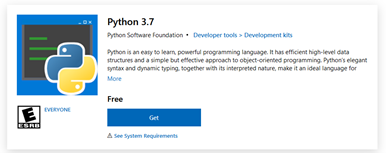
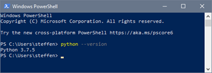

# ML for building classification: Manual

This mini-tutorial describes how to run the code that downloads StreetView
images, and trains a classifier to label them. The commands below assume you are
on Windows, but the code will of course work on Linux as well.

## Prerequisites 

The scripts are written in Python 3.7. To install Python on your machine, go to
_Microsoft Store_, search for Python, and download Python 3.7.



To check that it works, open _Windows Powershell_ and type `python --version`. We
will run commands from PowerShell for the rest of this tutorial, but other ways
of running Python is fine too.



This should print the Python version number; if it does _not_, a restart might be
required. 

To avoid problems with overwriting shared files, the code is stored on GitHub,
while all the data are kept on Dropbox, as before. To download the code,
go to https://github.com/smaeland/ml-for-building-typologies, click the green
"Code" button, then _Download ZIP_. Then double-click the downloaded file and
select _Extract all_, and place it somewhere convenient, for instance in
_Documents_. If you are already familiar with git, skip the instructions above
and do `git clone` as usual instead. 
Now, we can open _PowerShell_ again and go to the downloaded directory and list
the files:
```
cd Documents\ml-for-building-typologies-master\
ls
```
which returns
```
Mode                 LastWriteTime         Length Name
----                 -------------         ------ ----
-a----        25/05/2021     10:37           4513 download_streetview_images.py
-a----        25/05/2021     10:37           3719 process_building_list.py
-a----        25/05/2021     10:37             18 README.md
-a----        25/05/2021     10:37           1806 requirements.txt 
```

Next, we need to download a set of packages which the code depends on. To keep
this separate from other projects, we install these packages in a _virtual
environment_, which we create using Python. Still in PowerShell, in the code
directory, type
```powershell
python -m venv ml-env
```
This environment needs to be activated before use, by typing
```
ml-env\Scripts\Activate.ps1
```

> Pro-tip: PowerShell will show suggestions when pressing _Tab_ -- try it out by
> typing only parts of the directory name above, and then _Tab_.

You should note a green <span style="color:green">(ml-env)</span> text
appearing at the prompt, indicating that the environment is active. This line
above needs to be entered every time a new PowerShell window is opened.

Now, download and install packages by 
```powershell
pip install -r requirements.txt
```
Once done, we are ready to go ahead. All the steps in this section needs only
to be done once -- _**except**_ activating the environment, by calling
`ml-env\Scripts\Activate.ps1` as shown above, which loads all the installed
packages. 

## Prepare CSV files with building information

The official list of building numbers and their coordinates can be downloaded
from geonorge.no. 
_(Federica can add info here about how the `MatrikkelVyg_etaje-coordinates_Oslo.csv`
file was made)_

Starting from the CSV file containing building information, we do two
pre-processing steps before downloading images:
 1. The coordinates given by Matrikkelen are in EPSG:25832, but Google Maps
    requires WGS84, hence we need to transform them.
 2. For convenience we divide the list into districts (bydel). 
    Both steps are done by running 
```powershell
python process_building_list.py
```
which will create one CSV file per district (_bydel_), and place them in the
`csv` directory. The script assumes the usual Dropbox location for the CSV file.

## Downloading images

### Setting up Google StreetView API access

To find and download images we use the Google Maps StreetView API, which is in
principle very simple, but it takes some effort to set up an account. The steps
are, in general,
 1. Set up a Google account (if you use Gmail, you already have one), and log
    onto the Google Cloud service 
 2. Create a project, and add a credit card to it 
 3. Get an API key (a 40-character long list of letters and numbers)
The details are given in the official documentation, available at
https://developers.google.com/maps/documentation/streetview/overview. One
cannot start downloading images without having added a credit card, or other
means of payment, even though “modest” downloads are free. The cost is $7 per
1000 images, but usage below $200 per month is free, meaning approx. 28 500
free images per month. Ideally, we should have a NORSAR-wide account for this.

### Downloading

Once you have the API key, we are ready to start downloading. First specify
the key by typing
```powershell
$Env:GMAPS_API_KEY = "AIzaSyAM9..."
```
where the API key goes in the quotation marks. Now we can specify the CSV file
to use, the the directory where to save images, and run the download script
like so:
```
python download_streetview_images.py csv\building-list-Bjerke.csv images\Bjerke
```
This will take some time; to stop it before it finishes, press `Ctrl+c`.


## Training the classifier
